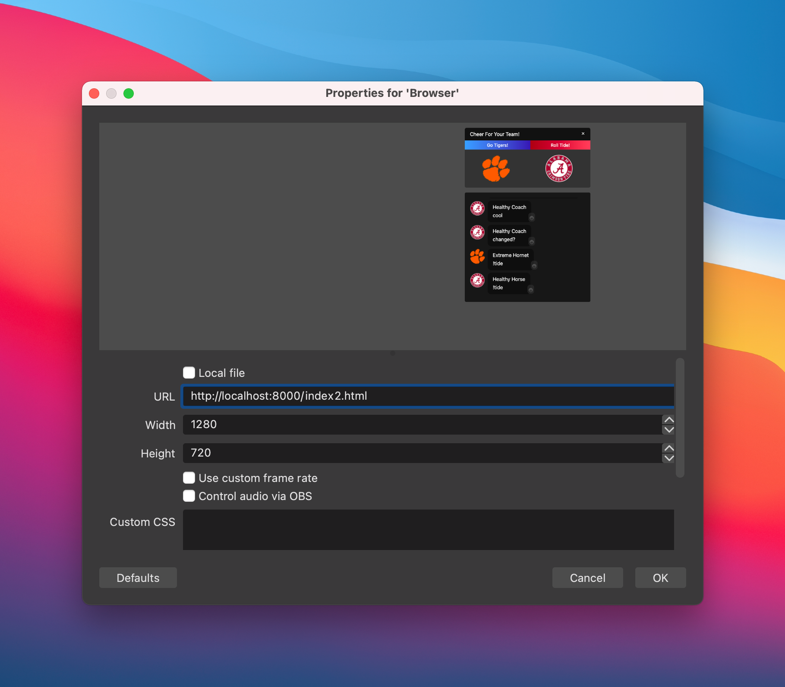

# Integrate LiveLike Chat and Widgets with OBS Studio

This project demonstrates how to integrate LiveLike Chat and Widgets directly into you video live streams using [The LiveLike WebSDK](https://docs.livelike.com/docs/getting-started-with-the-web-sdk) and the OBS Browser Source overlay plugin.


The simplest way to run the plugin is by changing into the `static` directly and using a simple HTTP server.

```shell
$ cd static
$ python3 -m http.server --bind 127.0.0.1
```



Since this is just rendering a plain HTML browser source you can even use advanced techniques such as websockets to control your LiveLike overlays remotely.  This browser source has all the functionality and features of a regular browser for displaying and interacting with LiveLike Chat and Widgets.